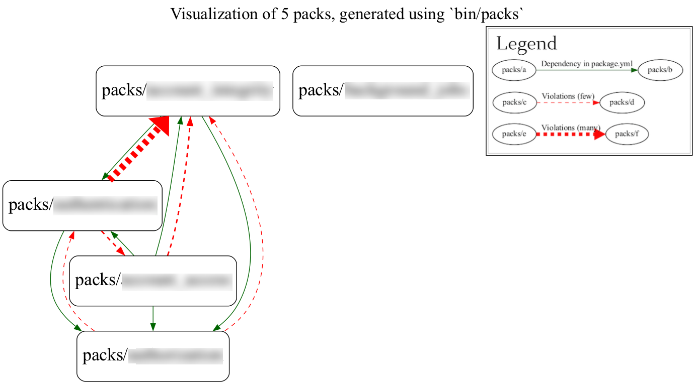

# visualize_packwerk

This gem helps visualize relationships between packwerk packs.



# CLI Usage
## bin/packs
For simpler use, add `bin/packs` via `use_packs` (https://github.com/rubyatscale/use_packs)
```
bin/packs visualize # all packs
bin/packs visualize packs/a packs/b # subset of packs
bin/packs # enter interactive mode to select what packs to visualize
```

# Ruby API Usage
## Building a package graph for a selection of packages
```ruby
# Select the packs you want to include
selected_packs = Packs.all
selected_packs = Packs.all.select{ |p| ['packs/my_pack_1', 'packs/my_pack_2'].include?(p.name) }
selected_packs = Packs.all.select{ |p| ['Team 1', 'Team 2'].include?(CodeOwnership.for_package(p)&.name) }
VisualizePackwerk.package_graph!(selected_packs)
```

## Building a team graph for specific teams
```ruby
# Select the teams you want to include
selected_teams = CodeTeams.all
selected_teams = CodeTeams.all.select{ |t| ['Team 1', 'Team 2'].include?(t.name) }
VisualizePackwerk.team_graph!(selected_teams)
```

# Want to change something or add a feature?
Submit a PR or post an issue!
