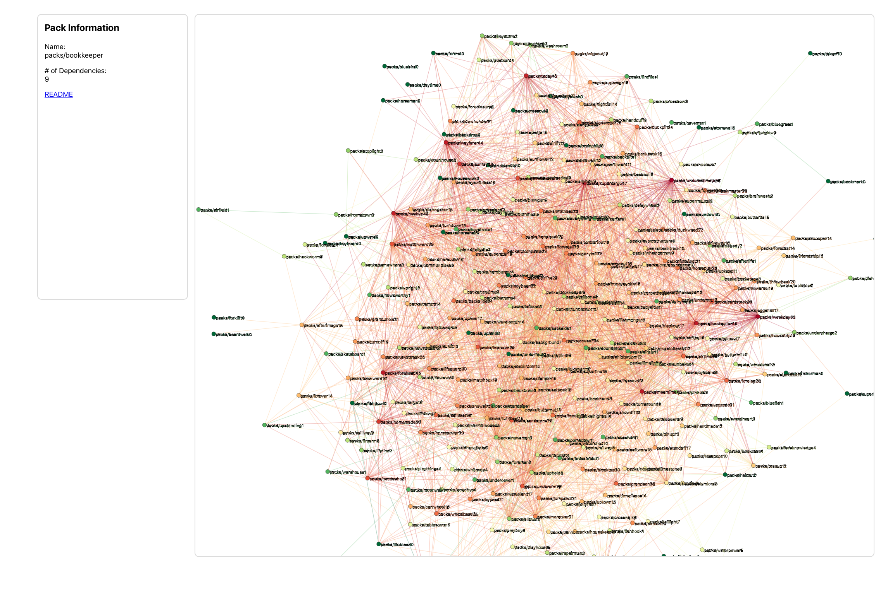

# modularity-graph

A d3 graph to visualize packwerk modularity.

## Setup

Environment variables required to start the graph:

- `RELATIVE_PATH_TO_REPOSITORY`: the path to your packwerk enabled repo relative to wherever you run the ruby script e.g. `../my_repo`
- `GITHUB_REPO_SLUG`: the uri identifying your repository on Github, e.g. for `https://github.com/MyOrg/myrepo/` the variable would be `MyOrg/myrepo`

To start the graph in `modularity-graph`:

1. Run `ruby parse_packwerk_integration.rb` from the command line. You can pass in the above environment variables like this:
- Example: `RELATIVE_PATH_TO_REPOSITORY='../../my_repo' GITHUB_REPO_SLUG='MyOrg/myrepo' ruby parse_packwerk_integration.rb`
2. Run `yarn start`
3. Go to `http://localhost:3000/`
